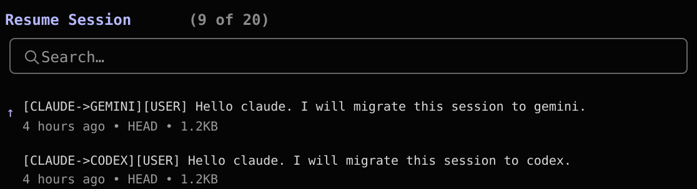
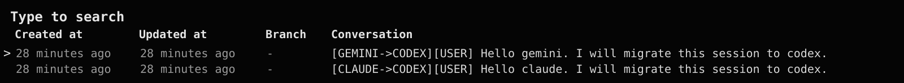
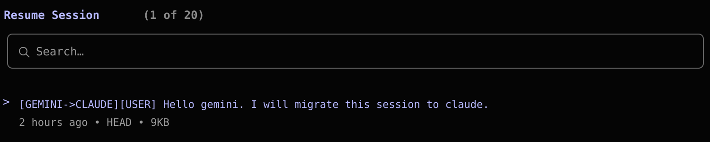

# AnyFork

[简体中文](./README.zh-CN.md) | English

AnyFork is an open-source CLI focused on one job:

fork a local session from one AI coding CLI into another AI coding CLI, while preserving the visible conversation and seeding a target-native resumable session whenever the target format is understood.

It is intentionally narrow, local-first, and independent from MineMemory.

## Demo

AnyFork is designed around real resume flows, not abstract transcript export.

### Claude -> Gemini



### Gemini -> Codex



### Gemini -> Claude



## Why this exists

Native fork usually stops at the product boundary.

That becomes painful when you:

1. spend a long time building context in one agent
2. realize another agent is better for the next step
3. do not want to summarize or manually rebuild the whole conversation

AnyFork removes that handoff tax. It reads a real local session, exports a portable bridge bundle, and writes target-native session data so the destination CLI can resume from a meaningful starting point.

## What AnyFork does

- forks sessions across `codex`, `claude`, and `gemini`
- preserves the visible transcript in order
- writes inspectable bridge artifacts under `.anyfork/`
- seeds target-native local session data when supported
- keeps the public CLI surface intentionally small

## What AnyFork does not do

- it does not clone vendor-private hidden runtime caches bit-for-bit
- it does not depend on a cloud backend
- it is not a memory platform or sync service
- it does not try to replace the native CLIs

The compatibility target is practical continuity, not a private internal cache dump.

## Installation

Requirements:

- `Node.js >= 22`
- the source CLI installed locally
- the target CLI installed locally

Install the user-facing package:

```bash
npm install -g @floatfu-true/anyfork-cli
```

Verify:

```bash
anyfork --help
```

Most users only need `@floatfu-true/anyfork-cli`.

`@floatfu-true/anyfork-core` exists for programmatic integration and internal reuse.

## Usage

If no subcommand is specified, AnyFork shows the main help.

```text
Usage: anyfork [OPTIONS]
       anyfork fork <FROM> <TO> <SESSION|last> [OPTIONS]

Commands:
  fork           Fork a source session from one CLI into another CLI
  help           Print this message or the help of the given subcommand(s)
```

Main command:

```bash
anyfork fork <from> <to> <session|last>
```

Examples:

```bash
anyfork fork codex claude last
anyfork fork claude codex 20486cab-8ead-4410-b2d2-8bb6e66ae804
anyfork fork gemini claude 3c5c4e92-b356-483b-ab96-7d14321e7f0c
anyfork fork codex gemini last --prompt "Continue implementation"
```

## How it works

1. Resolve the source session from local CLI storage.
2. Normalize and deduplicate the visible transcript.
3. Export a portable bridge bundle and a readable handoff note.
4. Seed target-native local session data when the target format is known.
5. Launch the target CLI through its native resume path unless `--dry-run` is used.

Bridge artifacts are written to:

```text
.anyfork/bridges/<from>-to-<to>-<session>-<timestamp>/
  bundle.json
  handoff.md
```

## Supported CLIs

Platforms:

- `codex`
- `claude`
- `gemini`

Current bridge directions:

- `codex -> claude`
- `codex -> gemini`
- `claude -> codex`
- `claude -> gemini`
- `gemini -> codex`
- `gemini -> claude`

## Repository layout

```text
assets/
  screenshots/
packages/
  cli/
  core/
tests/
README.md
README.zh-CN.md
LICENSE
```

## Package layout

- `@floatfu-true/anyfork-cli`
  the user-facing CLI package
- `@floatfu-true/anyfork-core`
  the lower-level bridge library used by the CLI

## Development

Install dependencies:

```bash
npm install
```

Run tests:

```bash
npm test
```

Run the CLI locally:

```bash
node packages/cli/src/index.js --help
node packages/cli/src/index.js fork codex claude last --dry-run
```

Create dry-run tarballs before publishing:

```bash
npm run pack:core
npm run pack:cli
```

## Safety and release hygiene

Before publishing or pushing public changes, verify:

- tests pass
- tarballs only contain expected package files
- `.anyfork/`, logs, debug output, and local bundles are ignored
- no secrets or private environment files are tracked

## Limitations

- compatibility depends on local storage formats exposed by each CLI
- if a vendor changes its on-disk session schema, AnyFork may need an update
- some CLIs are project-scoped, so the launch directory matters for resume visibility
- native resume pickers are controlled by the target CLI, not by AnyFork

## License

MIT
