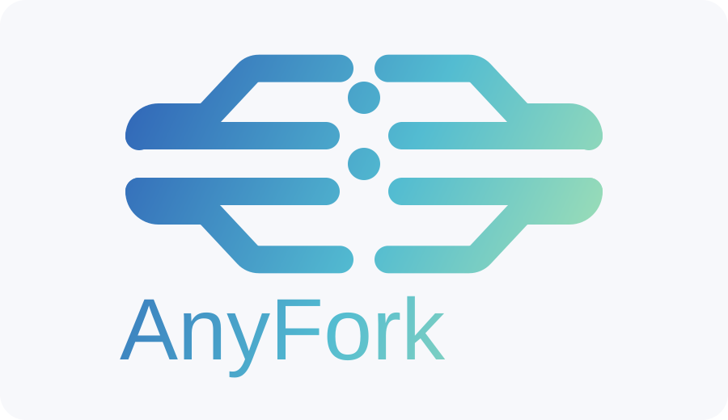

<a id="readme-top"></a>

<div align="center">
  <a href="https://github.com/FloatFu-true/Anyfork">
    
  </a>

  <h3 align="center">AnyFork</h3>

  <p align="center">
    在 Codex、Claude、Gemini 之间 fork 本地 session，并尽量保留目标端原生 resume 体验。
    <br />
    <a href="./README.md">English</a>
    ·
    <a href="https://github.com/FloatFu-true/Anyfork/issues">反馈问题</a>
    ·
    <a href="https://github.com/FloatFu-true/Anyfork/issues">功能建议</a>
  </p>

  <p align="center">
    <a href="https://www.npmjs.com/package/@floatfu-true/anyfork-cli"></a>
    <a href="https://www.npmjs.com/package/@floatfu-true/anyfork-mcp-server"></a>
    <a href="https://github.com/FloatFu-true/Anyfork/blob/main/LICENSE"></a>
    <a href="https://github.com/FloatFu-true/Anyfork/issues"></a>
  </p>
</div>

## 目录

- [项目简介](#项目简介)
- [0.1.6 更新重点](#016-更新重点)
- [包结构](#包结构)
- [快速开始](#快速开始)
- [CLI 用法](#cli-用法)
- [MCP 用法](#mcp-用法)
- [演示](#演示)
- [本地开发](#本地开发)
- [路线图](#路线图)
- [参与贡献](#参与贡献)
- [许可证](#许可证)

## 项目简介

AnyFork 是一个只聚焦一件事的开源工具集：

把一个 AI 编程 CLI 里的真实本地会话迁移到另一个 AI 编程 CLI，保留可见 transcript，并在目标端格式已知时写入可原生 resume 的本地 session 数据。

AnyFork 的边界很明确：

- 保留可见 transcript 的顺序
- 在 `.anyfork/` 下产出可检查的 bridge artifacts
- 在支持的平台上写入目标端原生 resume 数据
- 对外接口尽量小，减少不可控兼容面

AnyFork 不打算做这些事情：

- 云端同步平台
- 托管式 memory 服务
- 厂商私有隐藏缓存的逐字节克隆
- Codex、Claude、Gemini 原生 CLI 的替代品

## 0.1.6 更新重点

- 新增 `@floatfu-true/anyfork-mcp-server`，模型现在可以直接通过 MCP 查找相关本地 session，并导入到当前项目。
- 新增 4 个 MCP 工具：
  `anyfork_list_sessions`、`anyfork_find_relevant_sessions`、`anyfork_import_session`、`anyfork_find_and_import`。
- `--dry-run` 不再写入目标平台原生 session，避免误污染目标端数据。
- 为超长 transcript 增加预算与截断逻辑，避免 `Invalid string length`。
- `node:sqlite` 改为惰性加载，常规 `help` 与非 SQLite 路径不再出现之前的 warning。

## 包结构

- `@floatfu-true/anyfork-cli`
  面向用户的主 CLI，负责 `fork` 工作流。
- `@floatfu-true/anyfork-core`
  底层 bridge 能力，负责本地 session 解析、桥接产物导出、原生 resume 数据写入。
- `@floatfu-true/anyfork-mcp-server`
  MCP 服务端，负责“查找相关 session 并导入到当前项目”。

## 快速开始

### 前置要求

- `Node.js >= 22`
- 本地已安装源平台 CLI
- 如果要获得原生 resume 体验，目标平台 CLI 也需要已安装

### 安装 CLI

```bash
npm install -g @floatfu-true/anyfork-cli
```

验证安装：

```bash
anyfork --help
```

### 安装 MCP 服务端

全局安装：

```bash
npm install -g @floatfu-true/anyfork-mcp-server
```

或使用 `npx` 一次性启动：

```bash
npx -y @floatfu-true/anyfork-mcp-server@latest
```

## CLI 用法

不带子命令时，AnyFork 会显示主帮助。

```text
Usage: anyfork [OPTIONS]
       anyfork fork <FROM> <TO> <SESSION|last> [OPTIONS]

Commands:
  fork           Fork a source session from one CLI into another CLI
  help           Print this message or the help of the given subcommand(s)
```

核心命令：

```bash
anyfork fork <from> <to> <session|last>
```

示例：

```bash
anyfork fork codex claude last
anyfork fork claude codex 20486cab-8ead-4410-b2d2-8bb6e66ae804
anyfork fork gemini claude 3c5c4e92-b356-483b-ab96-7d14321e7f0c
anyfork fork codex gemini last --prompt "Continue implementation"
anyfork fork codex claude last --dry-run
```

桥接产物默认写到：

```text
.anyfork/bridges/<from>-to-<to>-<session>-<timestamp>/
  bundle.json
  handoff.md
```

当前支持的平台：

- `codex`
- `claude`
- `gemini`

当前支持的桥接方向：

- `codex -> claude`
- `codex -> gemini`
- `claude -> codex`
- `claude -> gemini`
- `gemini -> codex`
- `gemini -> claude`

## MCP 用法

### MCP 的意义

MCP 包主要解决“模型自己找 session、自己导入”的工作流：

- 根据用户需求查找本地 session
- 按 transcript 和项目路径匹配度排序
- 把命中的 session 导入当前项目
- 在目标平台支持时，写入可原生 resume 的本地数据

### 暴露出的 MCP 工具

- `anyfork_list_sessions`
  枚举 Codex、Claude、Gemini 的本地 session。
- `anyfork_find_relevant_sessions`
  按任务、Bug、需求描述搜索相关 session。
- `anyfork_import_session`
  把已知 session 导入到当前项目的目标平台。
- `anyfork_find_and_import`
  先搜索，再自动导入最匹配的一条。

### 推荐调用顺序

1. 先调用 `anyfork_find_relevant_sessions`，传入用户需求和当前 `cwd`。
2. 检查候选列表和分数是否合理。
3. 如果 session id 已知，就调用 `anyfork_import_session`。
4. 如果 session id 未知，就直接调用 `anyfork_find_and_import`。
5. 导入完成后，在目标 CLI 中走原生 resume 流程继续工作。

### 接入 Codex

下面命令已按本机 `codex mcp --help` 语法核对：

```bash
codex mcp add anyfork -- anyfork-mcp-server
```

或直接用 `npx`：

```bash
codex mcp add anyfork -- npx -y @floatfu-true/anyfork-mcp-server@latest
```

### 接入 Claude Code

下面命令已按本机 `claude mcp --help` 语法核对：

```bash
claude mcp add anyfork -- anyfork-mcp-server
```

或直接用 `npx`：

```bash
claude mcp add anyfork -- npx -y @floatfu-true/anyfork-mcp-server@latest
```

### 接入 Gemini CLI

下面命令已按本机 `gemini mcp --help` 语法核对：

```bash
gemini mcp add anyfork anyfork-mcp-server
```

或直接用 `npx`：

```bash
gemini mcp add anyfork npx -y @floatfu-true/anyfork-mcp-server@latest
```

### MCP 调用示例

模型想完成的目标可以写成：

```text
查找 AnyFork 开发过程中和 MCP 集成 Bug 相关的 session，并把它导入当前项目，目标平台使用 codex。
```

对应的典型参数：

```json
{
  "query": "AnyFork MCP integration bug and resume verification",
  "to": "codex",
  "cwd": "/absolute/path/to/current/project",
  "onlyCurrentCwd": true,
  "limit": 5,
  "dryRun": false
}
```

## 演示

### 30 秒宣传视频

- [观看宣传视频](./assets/demo/anyfork-promo-30s.mp4)

### 原生 resume 效果截图

#### Claude -> Gemini


#### Gemini -> Codex


#### Gemini -> Claude


## 本地开发

```bash
git clone https://github.com/FloatFu-true/Anyfork.git
cd Anyfork
npm install
npm test
```

本地运行：

```bash
node packages/cli/src/index.js --help
node packages/cli/src/index.js fork codex claude last --dry-run
node packages/mcp/src/index.js
```

发包前打包检查：

```bash
npm run pack:core
npm run pack:cli
npm run pack:mcp
```

## 路线图

- [x] 六个方向的跨 CLI session bridge
- [x] Codex、Claude、Gemini 的原生 resume 数据写入
- [x] MCP 搜索与导入服务
- [x] 中英文双语文档
- [ ] 增强厂商 schema 变化时的诊断信息
- [ ] 增加更细的 resume 对齐校验工具
- [ ] 补充贡献与发布流程文档

## 参与贡献

欢迎贡献，但建议继续保持 AnyFork 的边界清晰，聚焦“本地 session continuity”而不是无边界扩张。

1. Fork 本项目
2. 创建分支：`git checkout -b feature/amazing-feature`
3. 提交修改：`git commit -m "feat: add amazing feature"`
4. 推送分支：`git push origin feature/amazing-feature`
5. 发起 Pull Request

## 许可证

本项目基于 MIT License 发布。详见 [LICENSE](./LICENSE)。
